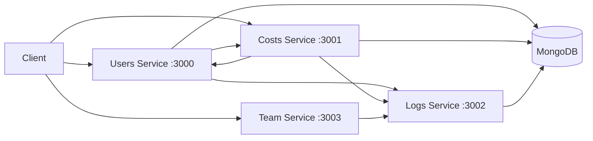

# Cost Manager Backend

A backend system for managing users, expenses, and monthly cost reports.

The project is built as four independent Node.js/Express services that communicate over HTTP and use MongoDB for persistence.

## Architecture



### Services

| Service | Responsibility |
| --- | --- |
| Users Service | User creation, retrieval and user information |
| Costs Service | Expense creation, totals and monthly reports |
| Logs Service | Centralized logging for the system |
| Team Service | Returns information about the development team |

The Users and Costs services communicate with each other over HTTP.
Application services send log events asynchronously to the Logs Service.

## Tech Stack

- Node.js
- Express.js
- MongoDB / Mongoose
- REST APIs
- Native Node.js test runner
- Render deployment

## Main API Endpoints

### Users Service — port 3000

- `POST /api/add`
- `GET /api/users`
- `GET /api/users/:id`
- `GET /api/users/:id/exists`

### Costs Service — port 3001

- `POST /api/add`
- `GET /api/total/:userid`
- `GET /api/report?id=<id>&year=<year>&month=<month>`

Historical monthly reports are calculated once and stored for reuse, while current reports are calculated dynamically.

### Logs Service — port 3002

- `POST /api/logs`
- `GET /api/logs`

### Team Service — port 3003

- `GET /api/about`

## Running Locally

1. Clone the repository.
2. Install the dependencies inside each service:

```bash
npm install
```

3. Configure the required environment variables using the provided `.env.example` files.
    You must provide your own MongoDB connection string through the `MONGODB_URI` environment variable.
   
4. Open a separate terminal for each service, navigate to that service's directory, and start it with:

```bash
node index.js
```

5. From the project root, run the automated API tests:

```bash
npm test
```

The tests expect the services to already be running locally.

## Deployment

The four services were deployed independently on Render, with environment-based service URLs and MongoDB Atlas configuration.

Live deployment URLs are intentionally not included in the repository documentation.
